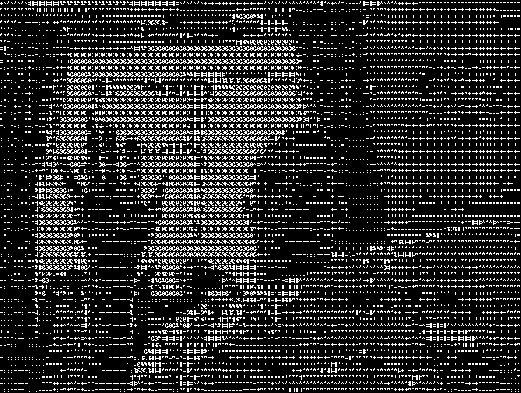

# ASCII Webcam

Transform your webcam feed into a dynamic ASCII art stream directly in your terminal! This Python application uses OpenCV to capture video and converts each frame into a grayscale ASCII representation, offering a unique visual experience.

## Features

- **Real-time ASCII Conversion:** Converts your live webcam feed into ASCII art.
- **Dynamic Terminal Resizing:** Automatically adjusts the ASCII output to fit your terminal window size.
- **Brightness Inversion:** Toggle between normal and inverted brightness for different visual effects.
- **Screenshot Functionality:** Capture and save your favorite ASCII frames as PNG images.

## Screenshot

Here's an example of the ASCII webcam in action:



## Installation

1.  **Clone the repository:**
    ```bash
    git clone https://github.com/sdmeers/ascii_webcam.git
    cd ascii_webcam
    ```

2.  **Create and activate a Conda environment (recommended):**
    ```bash
    conda env create -f environment.yml
    conda activate ascii_webcam
    ```
    *Note: If you encounter issues with `environment.yml`, you might need to remove the `prefix:` line from the file before creating the environment.* Alternatively, you can install dependencies manually:

3.  **Install dependencies (if not using Conda environment file):**
    ```bash
    pip install opencv-python numpy keyboard Pillow
    ```

## Usage

Run the `ascii_webcam.py` script from your terminal:

```bash
python ascii_webcam.py
```

### Controls

-   `q` or `Esc`: Exit the application.
-   `d`: Toggle brightness inversion.
-   `s`: Take a screenshot and save it as a `.png` file in the `screenshots/` directory.

## Future Improvements

-   Implement a more advanced background removal/blur effect (e.g., using deep learning models like `rembg` for person segmentation).
-   Add options for customizable ASCII character sets.
-   Improve performance for higher frame rates.
